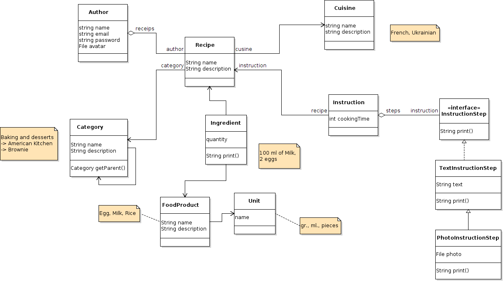

# Cheeful-cook
# ProjectForOOP - Leisure With Pleasure
## Description

Темою даного проекту є розробка програми "Веселий кулінар".

Вже 25, а все що Ви вмієте – готувати соус до маминих страв? Потрібно вразити близьку людину неординарною і смачною вечерею з десертом, приготованими власноруч? Чи просто поліпшити свої навички у кулінарії? Легко!

Метою цієї роботи є створення додатка, за допомогою якої користувач матиме можливість підібрати кулінарний рецепт на свій смак, а також поділитися з іншими користувачами своїми власними та улюбленими рецептами.

Дана програма стане у нагоді користувачеві, який постане перед бажанням власноруч приготувати певну страву. В залежності від намірів користувача він має змогу завантажити під своїм авторством повний рецепт та етапи приготування якоїсь страви, чи скористуватись пошуком рецептів від інших користувачів та обрати саме ту, що буде йому імпонувати (обравши якій національній кухні ця страва є притаманною, чи до якої харчової категорії ця страва належить). 

Програма буде складатися з двох основних частин: пошук і шер (поділитися). Користувач, перейшовши до відповідного розділу зможе інтуїтивно зрозуміти та виконати необхідні дії, для того, щоб відшукати приготування страви, що його цікавить, або розшерити поетапне приготування свого рецепту на загал для інших, відповідно.

В розширеній версії програми буде введена рейтингова система (найактивніші користувачі, чиї рецепти зберуть більше зірок під своїми постами можуть виграти вечерю в спонсорському ресторані, чи якусь окрему страву take-away), будуть коментарі (інші користувачі зможуть виразити слова подяки чи зауваги), кулінарний блог для початківців та вже впевнених кухарів (відео ролики, текстові пости), а також пошук страви за інгридієнтами (рецепт можна знайти у відповідності до того, що просто є у холодильнику користувача – все напрочуд просто). 

## Authors

1. Швайка Дмитро Ігорович.
2. Високос Андрій Володимирович.
3. Самусенко Владислав Андрійович.

## UML-diagram 
 
